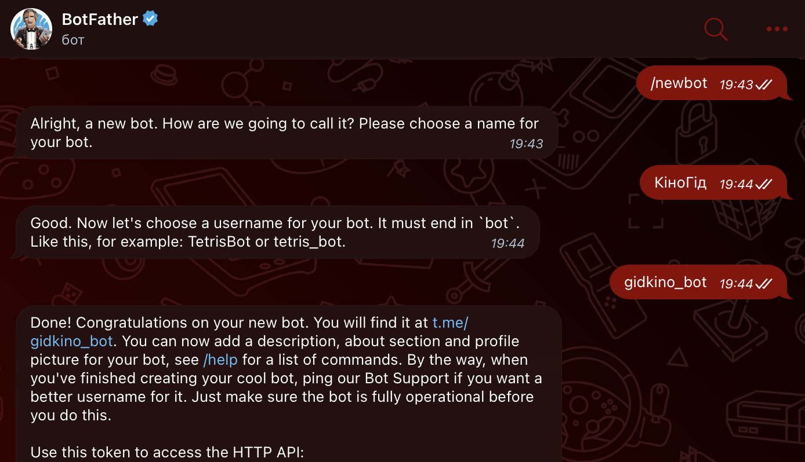
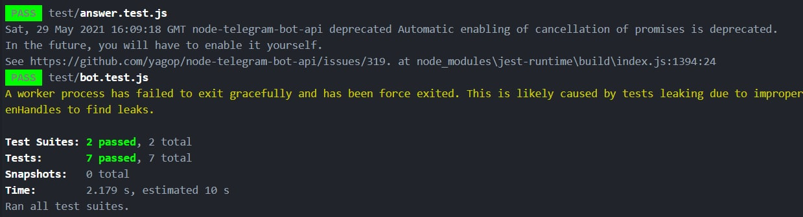

## Зміст

1. [Вступ](#вступ)
2. [Основні визначення](#основні-визначення)
3. [Технічне завдання](#технічне-завдання)
4. [Розробка](#розробка)
5. [Тестування](#тестування)
6. [Висновки](#висновки)

## Вступ

**Тема проекту:** "Практичне застосування платформи wit.ai"  
Аналіз тексту та виділення намірів із запитів користувачів, які обробляються в телеграм боті.

**Метою** документа є опис основної функціональності, практичності та експлуатаційної придатності, а також характеристика процесу розробки та експлуатації застосунку.

### Основні визначення
[Запит](https://uk.wikipedia.org/wiki/%D0%97%D0%B0%D0%BF%D0%B8%D1%82) - це формулювання своєї інформаційної потреби користувачем деякої бази
даних або інформаційної системи, наприклад, пошукової системи. Для складання запиту використовується мова пошукових запитів.

[Бот](https://uk.wikipedia.org/wiki/Робот_(програма)) — спеціальна програма, що виконує автоматично і/або за заданим розкладом які-небудь дії через ті ж інтерфейси, що й звичайний користувач. Під час обговорення комп'ютерних програм термін уживається в основному в застосуванні до Інтернету.

### Технічне завдання
**Постановка завдання**

Розробити бот, за допомогою якого користувач може отримати рекомендацію на фільм або підбірку, які його цікавлять.

**Способи вирішення завдання**

**Інтеграція з wit.ai**

Інтеграція з wit як платформою для обробки нативной мови: wit.ai — це платформа Facebook'а для обробки нативной мови для створення ботів зі штучним інтелектом, яка приймає на вхід текстову або голосову фразу "природною" мовою і пробує відповісти за допомогою нейромережі.

**Використання месенджеру Telegram**

Для зручного користування платформою wit на клієнтській стороні був розроблений телеграм-бот, який є проміжним прошарком та призначений для обробки запитів та відправки результату аналізу користувачу.

**Використання GitHub**

GitHub - безкоштовний сервіс з відкритим сирцевим кодом, що базується на Git та надає віддалений доступ до його репозиторіїв, забезпечує розміщення коду та допомагає в управлінні життєвим циклом розробки програмного забезпечення. Крім того, він містить такі функції, як сумісне використання коду декількома особами, відстеження помилок, та інші інструменти.


### Розробка телеграм-бота

Автор: *Dima Vihor*

Реєстрація бота та початкові налаштування в BotFather



Тепер встановимо node-telegram-bot-api - це бібліотека для створення телеграм-ботів на Node.js. Введемо команду:
```javascript
npm install --save --save-exact node-telegram-bot-api
```

Підключимо встановлену бібліотеку

```javascript
const TelegramBot = require('node-telegram-bot-api');
```

Створення нового бота. TG_TOKEN - це токен згенерований в BotFather.

```javascript
const bot = new TelegramBot(TG_TOKEN, {polling: true});
```

Обробник події надсилання будь-якого повідомлення

```javascript
bot.on('message', (msg) => {
    const chatId = msg.chat.id;
});
```

Приклад команди, яка відповідає за початок роботи з ботом.

```javascript
bot.onText(/\/start(.*)/, (msg, [source, match]) => {
    const chatId = msg.chat.id;
    bot.sendMessage(chatId, 'Хелоу ♂боді♂ \nЩо хочеш подивитись?');
});
```

``` onText() ``` - функція яка реагує на відсилання текстових повідомлень в чат

``` /\/start(.*)/ ``` - регулярний вираз з яким ми порівнюємо надіслані повідомлення

``` const chatId = msg.chat.id; ``` - змінна, що відповідає за id чату з якого прийшло повідомлення

``` sendMessage() ``` - функція яка відсилає текстове повідомлення в чат по вказаному id

В телеграм боті передбачена валідація отриманого повідомлення користувача та відправлення відповідей.

### Тренування нейромережі на платформі wit.ai

Автор: *Artem Sukach*

Результат роботи нейромережі це визначення наміру користувача за запитом та виділення сутностей у ньому.

У нашому проекті виділено два наміри ```movie_get``` та ```list_get```, які відповідають за бажання користувача подивитись конкретний фільм або побачити підбірку відповідно.

Сутності відповідають за головні об'єкти запиту. Наприклад: жанр, тип або назва movie.

Приклад тренування нейромережі:


### Аналіз результатів нейромережевої обробки

Автор: *Dima Vihor*

Підключення бібліотеки для роботи wit.ai

```javascript
const {Wit, log} = require('node-wit');
```

Створення об'єтку бота wit та його зв'язок по токену

```javascript
const client = new Wit({
    accessToken: WIT_TOKEN,
    logger: new log.Logger(log.DEBUG)
});
```

```client.message()``` відповідає за відправку повідомлення

```.then((data) => {})``` отримання результатів. data - відповідь JSON форматі

```const response = JSON.parse(JSON.stringify(data));```  запис у змінну response відповіді wit.ai

```const ans = answer(response);``` генерація відповіді користувачу
```javascript
client.message(msg.text, {})
    .then((data) => {
        const response = JSON.parse(JSON.stringify(data));
        const ans = answer(response);  // тут аналіз запиту
        bot.sendMessage(chatId, ans);  // відправка резалту
    })
    .catch(console.error);
```
### Відповідь користувачу

Автор: *Dima Vihor*

Модуль ```answer.js``` відповідає за генерацію відповіді користувачу та виклик функцій відповідно визначеного наміру. Відповідно до намірів ```movie_get``` та ```list_get``` створено функції які відповідають за генерацію посилання.

## Розробка

Автор: *Artem Sukach*

[Див. документацію коду]()
## Тестування

Автор: *Dima Vihor*

### Тест №1

Тестування валідації користувацьких повідомлень.
```javascript
describe('function validation users message', () => {
    test('example of an incorrect query', () => {
        expect( validator('NEkorektnyi_zapyt')).toBeFalsy();

    });
    test('example of a correct query', () => {
        expect( validator('Коректний запит')).toBeTruthy();

    });
});
```
### Тест №2

Тестування генерації відповіді.
```javascript
describe('function list_get processing', () => {
    test('example of an incorrect result', () => {
        expect( list_get(require_to_movie)).toBe('https://www.ivi.ru/movies/western');

    });
    test('example of a correct result', () => {
        expect( list_get(require_to_list)).toBe('https://www.ivi.ru/movies/boeviki');

    });
});
```
Решта тестів (```answer.test.js``` і ```bot.test.js```) розміщена [тут]()

**Результати тестування**



## Результат роботи бота


